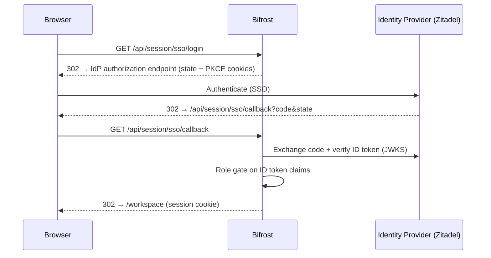

## Overview

SSO Login lets your team sign in to the Bifrost dashboard through an OIDC identity provider (IdP) instead of the built-in admin username and password. Bifrost implements the OAuth 2.0 authorization code flow with PKCE (S256), verifies the returned ID token against the provider's JWKS endpoint, and issues a regular dashboard session.

Any standards-compliant OIDC provider works. The defaults are tuned for [Zitadel](https://zitadel.com), including automatic handling of its project roles claim.

**Key behaviors:**

- **SSO-only** - when SSO is enabled, password login (`POST /api/session/login`) is rejected. There is always a dashboard access path that is not tied to the IdP's availability, but it requires editing the config file and restarting.
- **Role gate** - restrict dashboard access to identities holding specific roles from the IdP (for example `bifrost-admin`). An identity without the role is rejected at the callback.
- **Standard sessions** - SSO logins produce the same 30-day session cookie as password logins, so the WebSocket ticket flow, logs, and every other dashboard feature work unchanged.
- **Local logout** - signing out revokes the Bifrost session only. The identity provider session is untouched.

---

## How it works



Both SSO endpoints are whitelisted from dashboard auth, so the flow works before any session exists. Inference API authentication (virtual keys, `x-bf-vk` headers) is unaffected by SSO.

---

## Prerequisites

Set up an OIDC application in your identity provider first. For **Zitadel**:

1. Create a project (or reuse an existing one) and note its **project ID**.
2. Add an **application** of type *Web*, authentication method *Authorization Code* (PKCE is used by Bifrost automatically).
3. Set the **redirect URI** to `https://<your-bifrost-host>/api/session/sso/callback`. If Bifrost is reachable over plain HTTP on localhost, use `http://localhost:8080/api/session/sso/callback`. Leave Bifrost's `redirect_url` empty so it derives the same value from the request.
4. In the project, define a role (for example `bifrost-admin`) and assign it to the users who may access the dashboard.
5. Enable **Assert roles on authentication** for the project so the roles claim is embedded in tokens.

<Note>
Bifrost requests the scope `urn:zitadel:iam:org:project:roles` automatically when a role gate is configured with the default role claim, so Zitadel includes roles in the ID token. For other providers, make sure the configured `role_claim` is present in the ID token - use the `scopes` field if the provider needs extra scopes to emit it.
</Note>

---

## Configuration

This feature is configured via `config.json` (or environment variables) only - there is no dashboard form for it.

<Tabs group="config-method">
<Tab title="config.json">

```json
{
  "governance": {
    "auth_config": {
      "is_enabled": true,
      "admin_username": "admin",
      "admin_password": "$2a$10$...",
      "sso": {
        "enabled": true,
        "issuer_url": "https://auth.company.com",
        "client_id": "bifrost-dashboard",
        "client_secret": "env.ZITADEL_CLIENT_SECRET",
        "allowed_roles": ["bifrost-admin"]
      }
    }
  }
}
```

| Field | Type | Required | Description |
|-------|------|----------|-------------|
| `sso.enabled` | boolean | Yes | Enables SSO login. Implies auth is enabled; password login is rejected while active. |
| `sso.issuer_url` | string | Yes | OIDC issuer URL of the identity provider (e.g. `https://auth.company.com`). Endpoints are resolved via OIDC discovery. |
| `sso.client_id` | string | Yes | OAuth2/OIDC client ID of the registered application. |
| `sso.client_secret` | string | No | Client secret for confidential clients. Supports the `env.` prefix. Leave empty for public (PKCE-only) clients. |
| `sso.redirect_url` | string | No | Callback URL registered at the provider. Defaults to `https://<request-host>/api/session/sso/callback` derived from the incoming request. |
| `sso.scopes` | string\[\] | No | OIDC scopes to request. Default: `openid profile email`. |
| `sso.role_claim` | string | No | ID token claim carrying roles. Default: `urn:zitadel:iam:org:project:roles`. |
| `sso.allowed_roles` | string\[\] | No | Roles that may log in. Empty disables the role gate - any authenticated identity from the issuer gets in. |

The sibling `auth_config` fields (`is_enabled`, `admin_username`, `admin_password`) remain valid. Keeping them lets you fall back to password login by removing the `sso` block and restarting.

</Tab>
<Tab title="Environment variables">

Secrets support the `env.` prefix. This form keeps the client secret out of the config file:

```json
{
  "governance": {
    "auth_config": {
      "is_enabled": true,
      "admin_username": "admin",
      "admin_password": "$2a$10$...",
      "sso": {
        "enabled": true,
        "issuer_url": "https://auth.company.com",
        "client_id": "bifrost-dashboard",
        "client_secret": "env.ZITADEL_CLIENT_SECRET",
        "allowed_roles": ["bifrost-admin"]
      }
    }
  }
}
```

```bash
export ZITADEL_CLIENT_SECRET="your-secret-value"
```

</Tab>
</Tabs>

After restarting Bifrost, `GET /api/session/is-auth-enabled` reports `"auth_type": "sso"`, and the login page replaces the password form with a **Sign in with SSO** button.


### Role gate

With `allowed_roles` set, Bifrost reads the `role_claim` from the verified ID token and only issues a session when it contains at least one allowed role. The default claim uses Zitadel's object shape (`{"role-id": {"org-id": "role-label"}}`); simple string arrays and single strings from other providers are handled too.

<Warning>
Leaving `allowed_roles` empty disables the role gate: everyone who can authenticate at the identity provider can access the dashboard with full admin rights. Set at least one role for production deployments.
</Warning>

---

## Troubleshooting

### Login redirects back with "Invalid or expired SSO login state"

**Cause:** the `sso_state` cookie did not survive the round trip. Usually a redirect URI mismatch (http vs https) or a proxy stripping cookies.
**Fix:** make sure the redirect URI registered at the provider matches the scheme Bifrost sees, and set `X-Forwarded-Proto` on your reverse proxy so the secure cookie flag is correct.

### "SSO login rejected: missing required role"

**Cause:** the role gate did not find an allowed role in the ID token.
**Fix:** in Zitadel, confirm *Assert roles on authentication* is on and the user has the role. For other providers, check `role_claim` points at a claim that exists in the ID token (decode the token at jwt.io to inspect).

### 502 "Failed to reach the identity provider"

**Cause:** OIDC discovery from `issuer_url` failed - wrong URL, DNS/firewall issue, or self-signed TLS on the IdP.
**Fix:** verify `https://<issuer_url>/.well-known/openid-configuration` is reachable from the Bifrost container.

### Password login returns 403 "Password login is disabled"

**Cause:** SSO is enabled; this is expected behavior.
**Fix:** to regain access, remove or disable the `sso` block in `config.json` and restart Bifrost, then log in with the local admin credentials.

---

## Next Steps

- **[Virtual Keys](/features/governance/virtual-keys)** - inference API access is managed separately from dashboard login and is unaffected by SSO
- **[User Provisioning (Enterprise)](/enterprise/user-provisioning)** - SCIM-based directory sync, per-user RBAC, and business units for enterprise deployments
